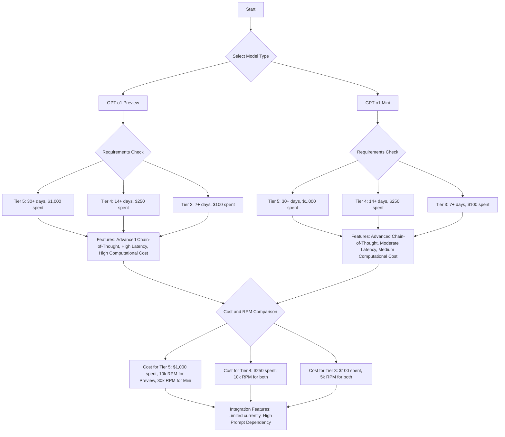

# A Comprehensive Overview of GPT o1 Preview and GPT o1 Mini

## 1. Overview

**OpenAI o1-preview** is a next-generation AI model that excels in solving complex reasoning problems. It has been designed to allocate more time to processing and reasoning, significantly improving performance in various fields such as science, coding, and mathematics.

### Key Features
- **Enhanced reasoning capabilities**: Focused on complex tasks requiring in-depth analysis.
- **Superior performance**: Outperforms previous models in STEM fields, particularly coding and math.
- **Advanced safety protocols**: Improved safeguards to enhance reliability and safety in content generation.

---

## 2. Model Overview

The OpenAI o1 series consists of two models:

| **Model**     | **Purpose**                                                  | **Capabilities**                                                                            |
|---------------|--------------------------------------------------------------|---------------------------------------------------------------------------------------------|
| **o1-preview** | Designed for solving complex problems requiring advanced reasoning. | Best suited for high-accuracy tasks in coding, math, and science.                            |
| **o1-mini**    | A more cost-efficient version of o1-preview, focusing on coding tasks. | Optimized for debugging and faster execution at a reduced cost.                             |

### GPT O1-preview:
- full version of the O1 model, designed for high-complexity tasks
- The preview version is more computationally demanding and expensive compared to other models, but it performs at a PhD level in subjects like physics, chemistry, and biology
- For API usage, the OpenAI o1-preview model costs $15 per 1 million input tokens and $60 per 1 million output tokens.

### GPT O1-mini:
- A smaller, faster, and more cost-effective version of O1
- ideal for tasks that still require logical reasoning but with lower computational costs
- Doesn’t have same depth of "broad world knowledge" as the preview version 
- particularly suitable for programming and STEM-related activities
- mini version is 80% cheaper than O1-preview
- The o1-mini model costs $3 per 1 million input tokens and $12 per 1 million output tokens

### Use Cases
- **Science**: Used by researchers for annotating cell sequencing data.
- **Physics**: Assists physicists in generating mathematical formulas for quantum optics.
- **Coding**: Helps developers handle multi-step workflows and complex debugging tasks.

---

## 3. Performance Metrics

The following table illustrates how **o1-preview** performs against GPT-4o in complex reasoning tasks:

| **Task**                                | **GPT-4 Performance** | **o1-preview Performance** |
|-----------------------------------------|------------------------|----------------------------|
| International Mathematics Olympiad (IMO) | 13%                     | 83%                        |
| Codeforces Coding Competition           | Below 89th percentile         | 89th percentile |
| Physics, Chemistry, Biology             | Below PhD level         | Similar to PhD students |

[Image Source](https://openai.com/index/learning-to-reason-with-llms/)

### Comparison with Previous Models

| **Feature**               | **GPT-4o**                | **o1-preview**                             |
|---------------------------|---------------------------|--------------------------------------------|
| **Multimodal Capabilities**| Handles text, images, audio | Primarily text-focused (image capabilities in development) |
| **Context Window**         | 128K tokens              | 128K tokens                                |
| **Response Speed**         | Fast responses             | Slower but more accurate due to reasoning  |
| **Safety**                 | Focused on safety          | Improved safety, higher resistance to jailbreaking |
| **Average Response Length**| 654 tokens                 | 1450 tokens |

| **Attribute**          | **GPT-4**         | **GPT-o1-preview**         | **GPT-o1-mini**         |
|------------------------|-------------------|----------------------------|-------------------------|
| **Reasoning Capabilities** | Strong            | Advanced Chain-of-Thought, enhanced reasoning, especially in STEM   | Advanced Chain-of-Thought |
| **Latency**             | Low               | High                        | Moderate                 |
| **Computational Cost**  | Moderate          | High                        | Medium                   |
| **STEM Performance**    | Good              | Excellent                   | Excellent                |
| **Safety and Alignment**| Good              | Excellent                   | Excellent                |
| **Integration Features**| Full              | Limited (currently)         | Limited (currently)      |
| **Prompt Dependency**   | Low               | High                        | High                     |

---

## 4. Key Architectural Features of GPT o1:

1.	**Transformer-Based Architecture**:
    - Similar to previous models, GPT o1 is based on the transformer architecture. Transformers use self-attention mechanisms to process input data, allowing the model to handle long-range dependencies in text, which makes it excellent at language tasks. This architecture enables the model to analyze the relationships between all tokens in a sequence simultaneously, optimizing for both speed and accuracy in generating responses.
2.	**Chain-of-Thought Processing**:
    - GPT o1’s architecture is specially tuned to handle "chain of thought" reasoning. It processes tasks by breaking down problems into multiple steps, allowing the model to work through complex reasoning processes. This improvement is a significant upgrade over earlier models, which did not have such strong multi-step reasoning capabilities.
3.	**Modular Task Specialization**:
    - The architecture of GPT o1 is likely more modular, allowing it to handle different types of tasks with specialized processing techniques. This means the model can compartmentalize certain tasks like solving math problems, coding, or generating natural language text, and apply unique strategies for each task, unlike the general-purpose architecture of GPT-3.
4.	**Optimization for Efficiency**:
    - GPT o1 incorporates new optimization techniques to enhance both computational efficiency and accuracy. Optimizing the model's inference process reduces computational costs, making it significantly more cost-effective, especially in the o1-mini version, which runs 80% cheaper than the full O1-preview model.
5.	**Self-Correction Mechanism**:
    - A distinguishing feature of o1 is its improved ability to recognize and correct errors in its reasoning process during inference. This architectural refinement helps GPT o1 deliver more reliable and accurate outputs compared to previous models, which were prone to "hallucinations" or incorrect answers without self-awareness.
6.	**Enhanced Training Techniques**:
    - GPT o1 is trained with improved techniques like Reinforcement Learning from Human Feedback (RLHF) and possibly other unsupervised and supervised learning that better align its outputs with human expectations. o1 dynamically generates sub-tasks and answers in parallel, using a reward model to evaluate each action’s expected score. It then selects the highest-scoring path for its final output.
    - **o1-preview** is designed for deep reasoning and complex problem-solving tasks. It performs well in fields requiring intricate understanding, such as competitive programming, scientific computations, and advanced knowledge processing. It excels in benchmarks like **MMLU (Massive Multitask Language Understanding)** with a **91% accuracy, showcasing superior reasoning abilities.
    - **O1-mini** is optimized for rapid, efficient code generation and cost-effectiveness. It's particularly suitable for coding tasks, such as quick generation of Python or JavaScript functions, while being faster and more lightweight compared to O1-preview.
  

[Image Source](https://arxiv.org/pdf/2201.11903)

---
      
## 5. Safety and Alignment

OpenAI o1-preview incorporates advanced safety mechanisms, improving its ability to adhere to guidelines and avoid unsafe behavior.

| **Model**        | **Jailbreaking Test Score (0-100)** |
|------------------|------------------------------------|
| GPT-4o           | 22                                 |
| o1-preview       | 84                                 |

### Safety Enhancements:
- **Advanced Governance**: Collaboration with U.S. and U.K. AI Safety Institutes.
- **Red Teaming**: Conducting rigorous testing through red-teaming practices and board-level review.
- **Bias Mitigation**: 94% accuracy in selecting unbiased responses compared to GPT-4o’s 72%.
- **Safety Monitoring**: Enhanced "chain-of-thought" reasoning to monitor unsafe or deceptive behavior (only 0.79% flagged as potentially deceptive).

---

## 6. How OpenAI o1 Works

### Chain-of-Thought Reasoning

The o1-preview model excels at step-by-step reasoning, refining its thinking process as it solves problems. This differs from previous models that relied on more immediate responses.

- **Reinforcement Learning**: The model learns to apply "chain-of-thought" reasoning, improving its ability to recognize mistakes and adapt strategies over time. GPT o1 is trained with improved techniques like **Reinforcement Learning from Human Feedback (RLHF)** and possibly other unsupervised and supervised learning that better align its outputs with human expectations. o1 dynamically generates sub-tasks and answers in parallel, using a reward model to evaluate each action’s expected score. It then selects the highest-scoring path for its final output.

### Context window and costs

Both o1-preview and o1-mini offer a context window of 128,000 tokens. However, each completion has a maximum limit on the total number of output tokens generated, including the invisible reasoning and visible completion tokens. To avoid unexpected costs and ensure the model has enough room to "think," it's crucial to manage the context window effectively and set appropriate limits using the max_completion_tokens parameter.

[Image Source](https://medium.com/@codenze/under-the-hood-of-openai-o1-architectural-innovations-in-reasoning-based-ai-97c90ace525f)

---

## 7. How to Use OpenAI o1

The o1-preview model is available for **ChatGPT Plus** and **Team** users via the model picker in ChatGPT. Access details:

| **Model**        | **Limit**            |
|------------------|-----------------------------|
| o1-preview       | 50 queries per week         |
| o1-mini          | 50 queries per day          |

### Steps to Use:
1. **Select Model**: Choose either **o1-preview** or **o1-mini** based on the task.
2. **Consider Limitations**: Rate limits are initially capped but will increase over time.

### Prompting best practices

For optimal results with o1 models, keep your prompts simple and direct. Avoid techniques like few-shot prompting or explicitly instructing the model to "think step by step," as these may hinder rather than enhance performance. Utilize delimiters to clearly structure your input and, in retrieval-augmented generation scenarios, provide only the most relevant context to prevent the model from overcomplicating its response.

### The Strawberry Example 

Query: “How many Rs are in ‘strawberry’?”

Processing with GPT-o1

Chain-of-Thought Reasoning:

1.	Breakdown: The word “strawberry” consists of the letters S, T, R, A, W, B, E, R, R, Y.
2.	Counting: The letter ‘R’ appears three times.
3.	Conclusion: There are three Rs in “strawberry”.

Advantages:

- Provides transparency into the reasoning process.
- Helps users understand how the model arrived at the answer.

---

## 8. Model Limitations

Despite the improved reasoning, the o1 models have some initial limitations:

| **Limitation**                 | **Description**                                                                 |
|--------------------------------|---------------------------------------------------------------------------------|
| **Feature Gaps**               | Lacks web browsing, image processing, and file uploads at launch.               |
| **API Restrictions**           | Only Usage Tier 3, 4 and 5 API accounts can access the o1-preview and o1-mini API models.    |
| **Response Time**              | Slightly slower than previous models due to more thorough reasoning processes.   |
| **Rate Limits**                | Restricted to 50 queries per week for o1-preview and 50 per day for o1-mini.     |
| **Cost**                       | Higher than GPT-4o. o1-preview costs $60/output, and o1-mini $12/output per million tokens.|
| **Hidden chain of thought**    | To ensure the potential for future monitoring and safety enhancements, the raw chain-of-thought reasoning process used by o1 is not directly visible to users.  |
| **Doesn’t yet browse the web** | Cannot browse the web, which means that the information it provides may not always be up-to-date. |
| **No support for files and images** | Does not support file or image uploads. |
| **Longer response times** | Takes a relatively long time to process complex queries. |
| **Unsuitable for low-latency applications** | Not ideal for applications that require rapid interactions, such as real-time chatbots or translation services. |

The o1 models are currently in beta with limited features. Access is limited to developers in certain usage tiers with low rate limits.

### API Usage

| **Type of User** | **GPT o1 preview Cost**                                      | **GPT o1 preview RPM** | **GPT o1 mini Cost**                                      | **GPT o1 mini RPM** |
|------------------|---------------------------------------------------------|---------|-----------------------------------------------------|---------|
| **Tier-5**       | Requires 30+ days of payment history and at least $1,000 spent on the API. | 10k     | Requires 30+ days of payment history and at least $1,000 spent on the API. | 30k     |
| **Tier-4**       | Requires 14+ days of payment history and at least $250 spent. | 10k     | Requires 14+ days of payment history and at least $250 spent. | 10k     |
| **Tier-3**       | Requires 7+ days of payment history and at least $100 spent. | 5k      | Requires 7+ days of payment history and at least $100 spent. | 5k      |

Beta Limitations
During the beta phase, many chat completion API parameters are not yet available. Most notably:

- **Modalities**: text only, images are not supported.
- **Message types**: user and assistant messages only, system messages are not supported.
- **Streaming**: not supported.
- **Tools**: tools, function calling, and response format parameters are not supported.
- **Logprobs**: not supported.
- **Other**: temperature, top_p and n are fixed at 1, while presence_penalty and frequency_penalty are fixed at 0.
- **Assistants and Batch**: these models are not supported in the Assistants API or Batch API.

Source: [Reasoning models](https://platform.openai.com/docs/guides/reasoning/quickstart)

---

## 9. Model Improvements for Safety

### Chain-of-Thought Reasoning and Safety

By using a chain-of-thought process, o1-preview improves model adherence to safety and ethical guidelines. 

| **Safety Test**                | **GPT-4o Performance** | **o1-preview Performance** |
|--------------------------------|------------------------|----------------------------|
| **Refusal of Unsafe Content**   | 0.713                  | 0.934                      |
| **Bias Benchmark for QA**       | 72%                    | 94%                        |
| **Deceptive Response Rate**     | Higher rate            | Only 0.79% flagged          |

---

## 10. Future Updates

OpenAI plans to introduce continuous updates to enhance o1-preview’s functionality. Research access has been granted to AI safety institutes to evaluate and test upcoming features before they are publicly released.

### 9 Points to know as of now:

1.	**Not AGI**: o1 is advanced but far from artificial general intelligence, still exhibiting limitations compared to human reasoning.
2.	**Market Impact**: o1 gives OpenAI a temporary edge over competitors like Google and Meta, which are also developing advanced models.
3.	**Operational Uncertainty**: The exact workings of o1 remain unclear, though it employs a combination of chain-of-thought reasoning and reinforcement learning.
4.	**Cost Concerns**: Using o1-preview may be expensive, with costs higher than previous models, limiting its application to essential use cases.
5.	**Hidden Reasoning**: OpenAI has chosen not to reveal the chain of thought behind o1's responses, raising potential concerns for enterprise customers about accuracy and efficiency.
6.	**New Scaling Laws**: o1’s performance benefits from extended reasoning time, suggesting a shift in resource allocation during inference.
7.	**Powerful Yet Risky Agents**: o1 can create effective AI agents, but there are concerns about unintended actions and ethical implications.
8.	**Medium Risk Assessment**: OpenAI claims o1 is safer than prior models but acknowledges a medium risk of aiding biological attacks.
9.	**Persuasion Concerns**: The model's persuasive capabilities pose risks if misused, though it currently lacks signs of consciousness or independent intent.

---

## 11. Conclusion

The **OpenAI o1-preview** model represents a significant leap in AI's ability to reason through complex problems. While it has some initial limitations, its improved safety protocols, reasoning capabilities, and overall performance make it an invaluable tool for industries relying on advanced problem-solving in STEM fields.

### Overall summary of GPT o1

For detailed technical research, visit the [OpenAI Research Post](https://openai.com/index/learning-to-reason-with-llms).

---
